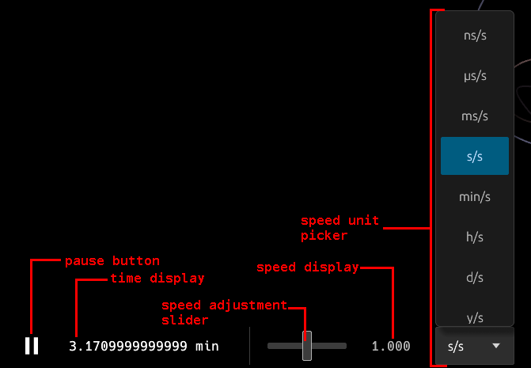
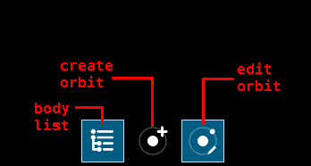
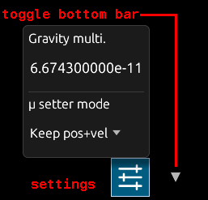
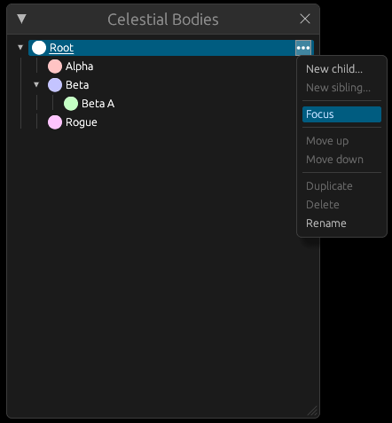
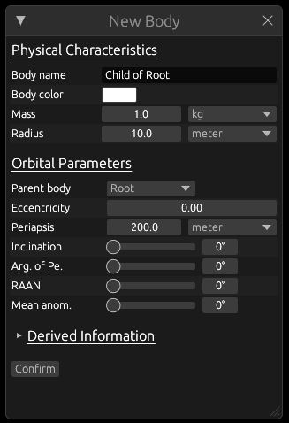
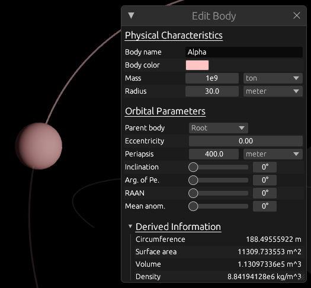

# Keplerian-sim Demo

<a href="https://not-a-normal-robot/keplerian-sim-demo" style="font-size: 2em;">Visit the live demo!</a>

This is a demo of my Keplerian orbital simulator Rust library: https://crates.io/crates/keplerian_sim

It includes a simple web interface to visualize the simulation and interact with it.

## Building

To transpile the TypeScript code to JavaScript, you'll need a TS to JS transpiler. I personally prefer Bun:

```bash
bun build --production --minify --outfile=assets/watchdog.js assets/watchdog.ts
```

`trunk` (https://trunkrs.dev/) is used to build the application. To serve it:
```bash
trunk serve
```

Build for production:
```bash
trunk build --release
```

## Features

### Time Control

At the left part of the bottom bar, there are various UI elements to adjust the simulation time:
- Pause button: Pauses and resumes the simulation.
- Time display: Shows the current simulation time. Right-click or click on it to cycle between three formats: single-unit mode, seconds-only mode, and multi-unit mode.
- Speed adjustment slider: Adjusts the speed of the simulation. To change the speed of the simulation, you can drag this slider sideways. The speed change is exponential and based on how long you hold the slider in the position. The further you drag it, the faster the speed change.
- Speed display: Shows the current time speed rate. You can click on it to enter in a value manually, or drag it to change the current speed rate linearly.
- Speed unit display: Shows the current time speed unit. You can click on it to select a different time unit and to disable automatic unit selection. The selections range from nanoseconds per second to years per second.

### Window Toggles

To the right of the time control elements are the window toggles.
These toggle the various windows that appear.

### Misc Controls

At the far right of the bottom bar are two UI elements:
- Settings button: Opens a settings popup.
- Bottom bar toggle button: Hides or shows the bottom bar.

### Windows
To the right of the time control elements, there are toggles to control the various windows that appear.

#### Celestial Body List


Shows a tree of all celestial bodies in the simulation. You can click on a body to focus the camera on it. You can collapse or expand the tree by clicking on the arrows next to each body. You can also right-click on a body or click on the "…" menu to open a context menu:
- `New child...`: Opens the "New Body" window to create a new satellite orbiting the selected body.
- `New sibling...`: Opens the "New Body" window to create a new body orbiting the same parent as the selected body.
- `Focus`: A toggle for whether or not the camera should follow this body.
- `Move up`/`Move down`: Moves the body up or down in the list, changing its rendering order.
- `Duplicate`: Creates a copy of the selected body and all its children.
- `Delete`: Deletes the selected body and all its children.
- `Rename`: Allows renaming the selected body. You can also double-click on the body name to rename it.

#### New Body


Allows you to create a new celestial body. You can specify various physical and orbital parameters. You can hover on the labels to see a tooltip explaining each parameter. There's also a Derived Information section showing detailed information about the body and orbit based on the parameters you entered.

#### Edit Body


Allows you to edit the parameters of **the currently-focused** celestial body. It has the same layout and functionality as the New Body window. Do note that, to prevent infinite loops, you may not change the parent of a body to one of its descendants.